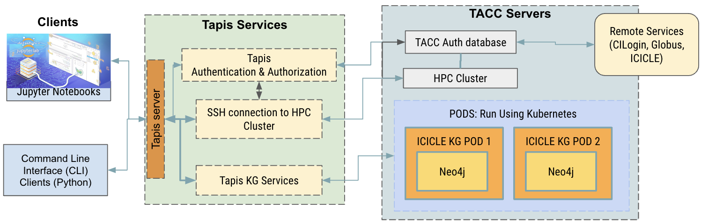

# Hello ICICLE Authentication Clients
Repo for Authenticated Clients and Applications for ICICLE CI Services

<a name="top">Contents:
* [Overview](#overview)
* [Software Releases](#sw-release)
* [About the Team](#about)
* [Acknowledgement](#acks)

## Overview </a>
The Artificial Intelligence (AI) institute for Intelligent Cyberinfrastructure with Computational Learning in the Environment (ICICLE) is funded by the NSF to build the next generation of Cyberinfrastructure to render AI more accessible to everyone and drive its further democratization in the larger society. ICICLE aims to develop intelligent cyberinfrastructure with transparent and high-performance execution on diverse and heterogeneous environments as well as advance plug-and-play AI that is easy to use by scientists across a wide range of domains, promoting the democratization of AI. The deep AI infrastructure that ICICLE plans to utilize to sift through data relies on knowledge graphs (KGs) in which information is stored in a graph database that uses a graph-structured data model or data model to represent a network of entities and the relationships between them. 

Finding a way to make KGs easily accessible and functional on high performance computing (HPC) systems is an important step in helping to democratize HPC. Thus a large focus of this project was contributing to the body of knowledge needed for hosting live, dynamic, and interactive services that interface with HPC systems hosting KGs for ICICLE based resources and services

In this project, we develop Jupyter Notebooks and Python command line clients that will access ICICLE resources and services using ICICLE authentication
mechanisms. To connect our clients, we used Tapis, which is a framework that supports computational research to enable scientists to access and utilize and manage multi-institution resources and services. We used Neo4j to organize data into a knowledge graph (KG). We then hosted the KG on a Tapis Pod, which offers persistent data storage with a template made specifically for Neo4j KGs. 
  
## Software Releases</a>

### [icicle_rel_03_2023](https://github.com/sdsc-hpc-training-org/hello_icicle_auth_clients/tree/main/icicle_rel_03_2023)

For this software release, we focussed on developing authenticated connections to kubernetes pods hosted on any Tapis service. These applciations are stand-alone and can be installed separately. For details, see:
* [Jupyter Notebooks](https://github.com/sdsc-hpc-training-org/hello_icicle_auth_clients/tree/main/icicle_rel_03_2023/CLI)
* [Command Line Interfaces](https://github.com/sdsc-hpc-training-org/hello_icicle_auth_clients/tree/main/icicle_rel_03_2023/Notebooks)

### Command Line Applications
Our CLI's are production software intended for use as interfaces to Tapis services hosted on HPC systems. These are ready to install and use, provided the proper [requirements](https://github.com/sdsc-hpc-training-org/hello_icicle_auth_clients/tree/main/icicle_rel_03_2023/CLI) are fulfilled.

### Jupyter Notebooks
The Jupyter notebooks in this repository are primarily [demonstrators](https://github.com/sdsc-hpc-training-org/hello_icicle_auth_clients/tree/main/icicle_rel_03_2023/Notebooks/ExampleApplications) for working Tapis code, written in python. We also made an [extensible template notebook](https://github.com/sdsc-hpc-training-org/hello_icicle_auth_clients/blob/main/icicle_rel_03_2023/Notebooks/TapisAuth/tapis_pods_auth.ipynb) which has Tapis auth prebuilt, and can be easily modified to carry out specific Tapis related tasks.

The Notebooks and the CLIs each have their own directory and software requirements which are described here: 

## About the Team 
This software was developed as part of the [SDSC/UCSD Smmer 2022 REHS Project](https://education.sdsc.edu/studenttech/rehs/), titled [*Developing Interactive Jupyter Notebooks to run on the SDSC HPC Expanse System and the “AI institute for Intelligent Cyberinfrastructure with Computational Learning in the Environment” (ICICLE) project.*](https://github.com/sdsc-hpc-students/REHS2022)

* _Project Lead:_  Mary Thomas, Ph.D., SDSC HPC Training lead, and Computational Data Scientist in the Data-Enabled Scientific Computing Division.
* REHS Students:
   * Sahil Samar, Del Norte High School, San Diego, CA, sahilsamar031@gmail.com
   * Mia Chen, Westview High School, San Diego, CA, mialunachen@gmail.com
   * Jack Karpinski, San Diego High School, San Diego, CA, USA, jackadoo4@gmail.com
   * Michael Ray, JSerra Catholic High School, San Juan Capistrano, CA, m.ray37990@gmail.com
   * Archita Sarin, Mission San Jose High School, Fremont, CA, archita.sarin@gmail.com
* Collaborators/Mentors:
   * Christian Garcia, Engineering Scientist Associate (Texas Advanced Computing Center [5]).
   * Matthew Lange, Ph.D., CEO, International Center for Food Ontology Operability Data and Semantics (IC-FOODS [4]); 
   * Joe Stubbs, Ph.D., Manager, Cloud & Interactive Computing (Texas Advanced Computing Center [5]).

## Acknowledgement 
This work has been funded by grants from the National Science Foundation, including:
* The AI Institute for Intelligent CyberInfrastructure with Computational Learning in the Environment (ICICLE) (_#2112606_);
* The SDSC Expanse project (_#1928224_)
* The TACC Stampede System (_#1663578_) 
* Tapis projects (_#1931439_)
* the NSF Track 3 Award: COre National Ecosystem for CyberinfrasTructure (CONECT) (_#2138307_) and the Extreme Science and Engineering Discovery Environment (XSEDE) (_ACI-1548562_).

* NOTES:
  * YAML file: See
  * Component Data Yaml file:  https://github.com/ICICLE-ai/CI-Components-Catalog/blob/master/components-data.yaml

